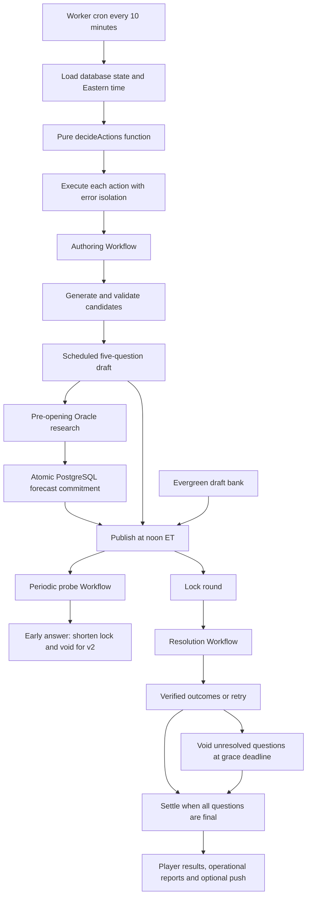

# ORACLE pipeline architecture and additions

Updated September 7, 2026. Describes the implementation on main through `65adf73`, followed by proposed additions. Repository configuration is not confirmation of production deployment or enabled secrets.

## Purpose and design

Hermes produces the daily questions, prepares the Oracle opponent, opens and closes play, verifies outcomes, and settles results. The core decision loop is deterministic TypeScript. AI handles bounded research and judgment tasks; database rules and application validation determine which outputs may affect gameplay.

Keep this separation as the pipeline grows. More useful research, stronger records and better evaluation can improve the experience without giving an autonomous agent control over publication deadlines, scoring or live prompt changes.

## Current flow

Arrows describe lifecycle dependencies, not one synchronous transaction. Each tick decides from a snapshot; effects of a dispatched Workflow or a lock can be picked up on a later tick. A missing Oracle forecast does not block an otherwise publishable round.

## Runtime and code map

All source paths below are relative to the repository root.

| Component | Responsibility | Source |
| --- | --- | --- |
| Worker entrypoint | Environment, dependencies, scheduled handler and Workflow exports | `apps/api/src/worker.ts` |
| Deployment configuration | Ten-minute cron, three Workflow bindings, configurable model roles | `apps/api/wrangler.jsonc` |
| Decision core | Read state; choose actions from Eastern time and a plain state snapshot | `apps/api/src/pipeline/state.ts`, `clock.ts` |
| Tick executor | Meter AI calls, execute/dispatch actions, catch individual failures | `apps/api/src/pipeline/index.ts` |
| Workflow adapter | Dispatch author, resolve and probe; hourly instance IDs; inline fallback | `apps/api/src/pipeline/workflows.ts` |
| Workflow entrypoints | Rebuild metered dependencies and invoke pipeline runners | `apps/api/src/pipeline/workflow-entrypoints.ts` |
| Authoring | Candidate generation, validation, selection and scheduled draft persistence | `apps/api/src/pipeline/gauntlet/`, `candidate.ts`, `editorial.ts`, `draft.ts` |
| AI adapter | Structured research interface consumed by pipeline stages | `apps/api/src/pipeline/claude.ts` |
| Forecasting | Crowd-blind input, five validated probabilities, versioned commitment | `apps/api/src/pipeline/forecast.ts` |
| Publication and settlement actions | Publish, bank fallback, lock, void and settle orchestration | `apps/api/src/pipeline/actions.ts` |
| Outcome checks | Two-model resolution and open-window early-answer probes | `apps/api/src/pipeline/resolve.ts`, `resolver.ts`, `probe.ts` |
| Operations | Call budget, Telegram narration, quality and leak reports | `apps/api/src/pipeline/spend.ts`, `telegram.ts`, `quality.ts`, `leak.ts` |
| Persistent state | Neon/Postgres via Drizzle; rounds, questions, evidence and spend | `apps/api/src/db/schema.ts`, `apps/api/drizzle/` |

## Current schedule

Times are America/New_York, including daylight-saving changes. The cron fires every ten minutes; `minute < 10` normally selects the first firing of an hour. These are eligible attempts, not guarantees that external work finishes at that time.

| Window | Action |
| --- | --- |
| 03:00 | Add one evergreen bank entry when fewer than five unused entries remain. |
| 09:00, 10:00, 11:00 | Forecast today's scheduled round if an AI client exists. An existing commitment returns without another model call. |
| Noon or later | Lock an expired open round, then publish today's draft when no open round blocks it. If no round exists and no draft is available, try the bank. |
| Every four hours, first tick | Probe eligible questions in the current open round for answers that have appeared early. |
| Locked round, before grace deadline | Attempt resolution throughout the noon hour and otherwise on the first tick of each hour. |
| Noon two days after round date | Void remaining unresolved questions. Normal lock is noon the day after round date. |
| All questions final | Settle the locked round on a subsequent eligible tick. |
| 17:00–23:00, first tick each hour | Attempt authoring for tomorrow if its scheduled draft is absent. |
| Operational alert windows | Report missing drafts, low bank, missing publication, unresolved questions and missing AI configuration. See `state.ts` for exact predicates. |

The state loader selects the oldest locked round for resolution/settlement. The pipeline is not currently a batch processor over every outstanding round in a single tick.

## Authoring and quality gates

The normal authoring Workflow runs the gauntlet in this order:

1. Generate candidates.
2. Apply structural and recent-topic screening.
3. Check source reachability with HTTP requests.
4. Run the critic and contestedness checks.
5. Preflight surviving questions through research.
6. Apply the taste check, then editorial assessment.
7. Select five questions and persist a scheduled draft.

Rejected candidates do not get reinstated by later tiers. If selection fails, no draft is written; a bank entry may cover the eventual drop. Candidate counts and rejection tallies support operational feedback, but a full stored record of every rejected candidate is not implemented. The gauntlet result's `published` field means it wrote the draft, not that players can already access an open round.

Evergreen bank generation is a separate path in `author.ts`; it must not be assumed to run every gauntlet stage. Bank drafts are checked again when used. Publication tries at most five entries in one call, skipping entries that cannot be validated or scheduled.

## Oracle fairness and the recent fix

Forecasting now happens before the round opens. Its input allowlist excludes player predictions and the author's probability target. Structured validation requires exactly one probability for each of five slots; 50% is allowed when supported by the evidence.

Migration `0009_mighty_big_bertha.sql` supplies `commit_oracle_forecast`, a PostgreSQL function that checks the live question snapshot and opening deadline under locks, then writes all five probabilities and round metadata atomically. Metadata includes database commitment time, model, prompt version and the question/probability snapshot. Concurrent or repeated commitments preserve the first successful record. Late, partial or changed-snapshot commits cannot replace it.

Database triggers protect the committed question set and forecast metadata. Admin edits and rerolls are rejected after commitment. The early-answer protection path can still shorten a lock; ordinary resolution remains available. Public prediction submission also requires an open parent round, an open question and a passed opening time.

A missed preparation window or noon bank fallback opens without a new Oracle duel. There is no post-opening catch-up. Historical probabilities remain unchanged, without newly asserted cutoff provenance.

## Resolution and settlement

Resolution requests two configured model roles in parallel for each question. Both must return the same settled outcome; disagreement or an unverifiable result leaves the question unresolved for retry. Evidence stores the readings and model identities. Different model roles offer a second check, but do not guarantee independent errors or factual correctness.

Questions are processed sequentially within the resolution runner, with individual error handling. The code rechecks state before applying a result so long-running work does not intentionally replace an outcome finalized while research was in flight. Unresolved questions reach the grace deadline and void rather than receiving a guessed answer.

During play, a probe can discover that an answer already exists. It only moves the lock earlier. Under v2 rules, the affected question is void for everyone, including a repair path for an interrupted void operation. Probing is periodic, so it is not a guarantee of immediate detection.

Settlement uses the existing resolution/scoring code, produces operational quality/leak reports and can send a hinge push through configured OneSignal credentials. Missing push credentials do not create a new scoring dependency.

## Execution, cost and present limitations

Authoring, resolution and probes have Workflow bindings. Each current Workflow wraps its runner in one coarse `step.do`; the implementation does not checkpoint every research call individually. Hourly instance IDs suppress duplicate dispatch in that hour. They do not eliminate all overlapping work across hours, so write guards remain necessary.

Forecasting and bank authoring are currently awaited inside the cron tick. An inline fallback also runs the other runners in-process when Workflow bindings are absent. Do not describe all model work as durably dispatched today.

The configured daily budget permits 150 structured model calls per metered Eastern date. Calls are charged before execution, including failed attempts. This is a call-count ceiling, not a dollar, token or web-search-cost budget. The tick and Workflow entrypoints apply the meter. Lock, publish, void and settle do not require model calls, so exhaustion does not itself block those actions.

The tick catches action failures; Telegram is operational narration rather than the authoritative state record. Existing guards and retry behavior should not be generalized into a claim that every pipeline action is one atomic transaction: the new forecast commitment is atomic, while several lifecycle actions use multiple statements.

## Proposed additions, in priority order

These entries are not implemented by this document. Validate them against launch observations before scheduling work.

| Priority | Addition | Concrete implementation | Completion criterion |
| --- | --- | --- | --- |
| First | Verify the deployed lifecycle | Apply migration before Worker rollout; exercise scheduled draft → commitment → opening → outcome → settlement in a test environment, including missing AI and bank fallback. | A complete recorded cycle with correct states, deadlines and player results. |
| Next | Durable forecast execution | Add a forecast Workflow kind/binding, with a round/version run key and the existing database cutoff checks. Consider bank authoring next if runtime evidence justifies it. | Retries and delayed completion cannot produce late or duplicate commitments; publishing remains independent. |
| Next | Operational run records and coverage | Store run ID, stage, version, start/end time, status, error and counts. Alert on any missing pre-open commitment, not only absent client configuration. | Operators can distinguish no attempt, validation rejection, deadline miss and external failure for a given round. |
| Next | Preserve pre-seal research evidence | Store source excerpts, retrieval timestamps, relevant base rates and evidence actually used, linked to a question/run version. | Every displayed pre-seal lesson and research claim is traceable to its stored input. |
| Then | Deterministic Oracle evaluation | TypeScript/SQL Brier loss, calibration counts, coverage and version comparisons over resolved records. | Reproducible reports with voids, corrections and legacy cutoff uncertainty handled explicitly. |
| Then | Shadow candidates and reviewed promotion | Versioned candidate runs with the same questions and cutoff; separate experimental budgets; promote by active-version configuration. | Prospective evidence supports improvement without compromising coverage or historical records. |
| As needed | Finer Workflow checkpoints | Split costly research stages into resumable steps with persisted inputs and guarded outputs. | Failure recovery avoids repeating completed expensive work without replaying unsafe mutations. |
| As needed | Authoring-quality history | Persist candidate rejection reasons and connect question outcomes to authoring versions. | Repeated ambiguity or source failures can be traced and corrected from evidence rather than anecdotes. |

## Where more agentic behavior could help

Bounded research is the useful place to add autonomy: seek a missing primary source, check contradictory evidence, or propose a revised candidate with a limited number of attempts. A reviewer can inspect measured failures and propose prompt changes for a new version.

Keep validation, deadlines, scoring, commitment and promotion explicit. A model should not approve its own live prompt revision, choose a convenient resolution when sources disagree, or use player answers to improve the competitive Oracle after play begins. Begin with the current TypeScript, Claude adapter, Zod, Drizzle and Workflows rather than adding an orchestration framework solely to make the pipeline “more agentic.”

## Verification and deployment notes

Use pure decision tests for the schedule; fake AI clients and PGlite for pipeline behavior; real multi-session PostgreSQL tests for lock contention and atomicity. Check runtime bindings and complete a deployed test cycle separately from unit tests. Migration-before-code ordering is required for the commitment columns and functions.

This document does not deploy, apply migrations, alter secrets or implement the proposed additions.

## Related documents

- [Forecasting additions roadmap](../gameplay/forecasting-additions-roadmap.md): player-facing priorities, seasons and partnership ideas.
- [Oracle learning implementation path](oracle-learning.md): proposed tables, modules and calibration example.
- [Oracle commitment verification](../gameplay/oracle-commitment-verification.md): regression and concurrent-session checks.
- [Launch playbook](../launch-playbook.md): broader release sequence.
